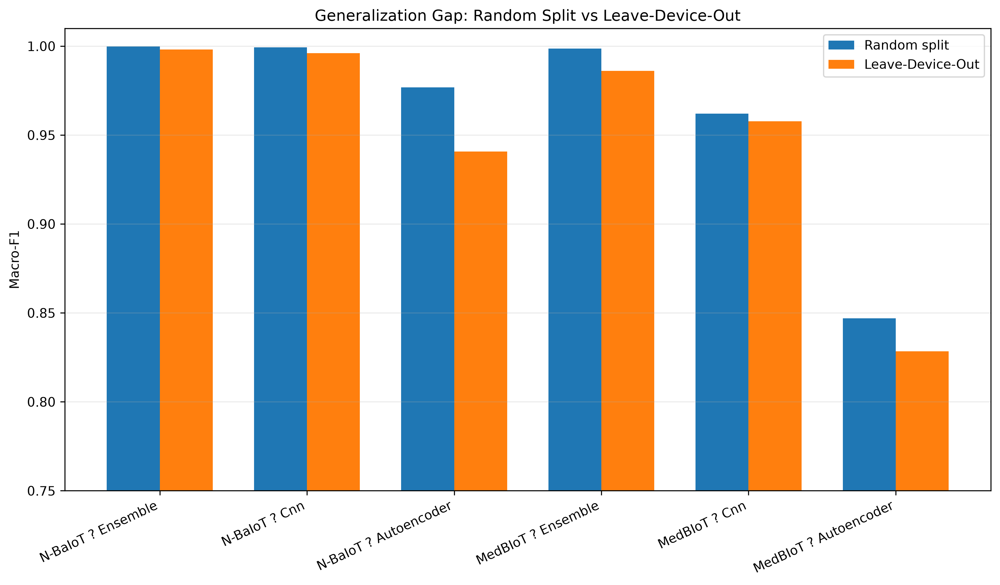
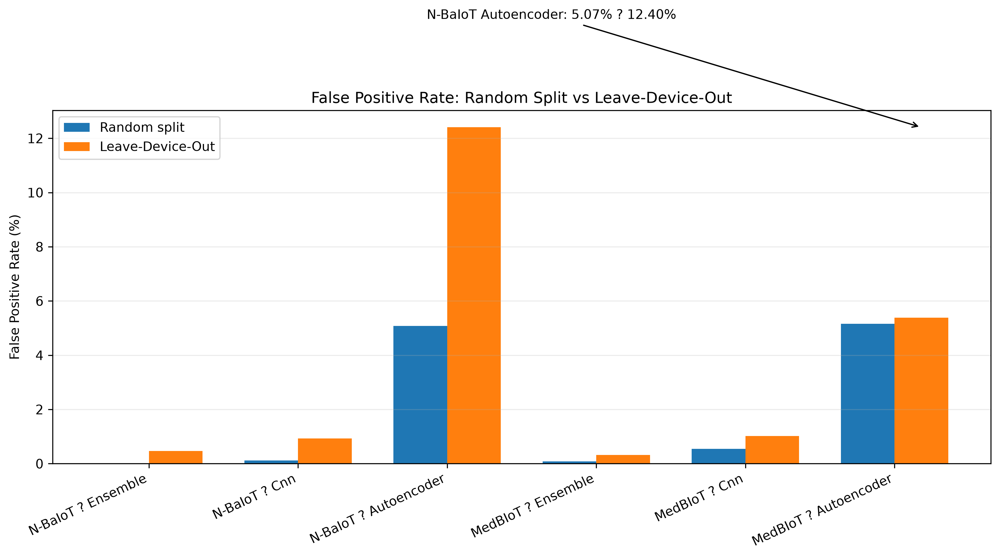
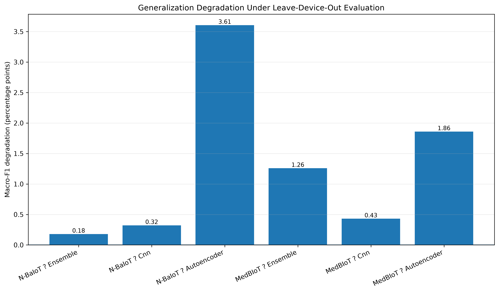

# Milestone 7 — Final Analysis Report

## Abstract

This study evaluates three established machine-learning detector families—an ensemble classifier, an autoencoder, and a 1D convolutional neural network (CNN)—for IoT botnet detection under both conventional random-split evaluation and a stricter Leave-Device-Out (LDO) protocol. The experiments use two heterogeneous datasets, N-BaIoT and MedBIoT, and retain a common 100-feature representation after dataset-specific preprocessing. The final evaluation contains 126 experiment records: 18 random-split baseline runs and 108 LDO runs, covering three random seeds and all nine N-BaIoT devices or three MedBIoT device types.

The principal finding is that random row-level splits produce extremely high performance for supervised detectors, but LDO evaluation reveals the degree to which those results depend on device-specific distributions. The Ensemble remains the strongest overall detector, achieving mean LDO Macro-F1 of 0.9981 on N-BaIoT and 0.9861 on MedBIoT. The CNN follows with 0.9961 and 0.9578 respectively. The Autoencoder is substantially more sensitive to distribution shift, with LDO Macro-F1 of 0.9408 on N-BaIoT and 0.8284 on MedBIoT. The N-BaIoT Autoencoder also exhibits the clearest false-positive-rate increase, from 5.07% under random splitting to 12.40% under LDO.

These results demonstrate that conventional random-split evaluation can overstate practical generalization to unseen IoT devices. LDO evaluation provides a more deployment-relevant assessment because the held-out device or device type contributes no training rows. The study therefore supports reporting both random-split baselines and device-disjoint evaluation when assessing IoT botnet detectors.

---

## 1. Executive Summary

### Context

IoT botnet detection systems are often evaluated using random train/test splits. Although such splits are useful as reproducible baselines, they can allow observations from the same physical device or device type to appear in both training and test sets. This can produce optimistic estimates when device-specific traffic characteristics are learned by the detector.

This study addresses that evaluation concern through a Leave-Device-Out protocol. The central question is not simply whether a detector can classify known traffic accurately, but whether an established detector can maintain performance when evaluated on a device distribution that was not represented during training.

### Experimental design

Three detector families were evaluated:

1. **Ensemble classifier** — soft voting over Random Forest, Extra Trees, and Gradient Boosting.
2. **Autoencoder** — unsupervised anomaly detector trained only on benign training observations, with the anomaly threshold determined from training-benign reconstruction errors.
3. **1D-CNN** — supervised binary classifier operating over the 100-feature representation.

Two datasets were evaluated:

- **N-BaIoT:** nine physical IoT devices.
- **MedBIoT:** three device types—fan, light, and switch.

Two evaluation protocols were used:

- **Random split:** stratified row-level train/test split.
- **Leave-Device-Out:** one physical device or device type held out completely from training.

Each experiment used three random seeds: 42, 43, and 44. The final source file contains 126 unique experiment records with no duplicate experiment keys and no smoke-test-sized rows.

### Main result

The Ensemble is the strongest overall detector under LDO evaluation, but the magnitude of its advantage depends on the dataset. On N-BaIoT, Ensemble and CNN performance is very close relative to observed variability. On MedBIoT, the Ensemble maintains a clearer advantage.

The Autoencoder shows the largest sensitivity to device distribution shift. Its N-BaIoT Macro-F1 decreases from 0.9768 under random splitting to 0.9408 under LDO, while its FPR rises from 5.07% to 12.40%. On MedBIoT, its Macro-F1 decreases from 0.8470 to 0.8284 and its FPR remains approximately stable at 5.16% versus 5.38%.

The supervised models are substantially more robust, although LDO still causes measurable degradation in false-positive behavior.

---

## 2. Methodology

### 2.1 Data representation

Both datasets were transformed into a standardized 100-feature representation. N-BaIoT originally contains 115 feature columns; the 15 H-family features were excluded to obtain the common 100-feature representation used by the final experiments. MedBIoT already provides the corresponding 100-feature representation.

Binary labels were assigned as:

- `0` — benign traffic
- `1` — attack traffic

Class-wise sampling was capped at 100,000 observations per device/device type during preprocessing.

### 2.2 Leakage-safe scaling

For final model evaluation, scaling is fitted exclusively on the training partition and then applied to the held-out test partition. Under LDO evaluation, the held-out device/device type therefore has no influence on the fitted scaler.

This distinction is important because preprocessing statistics derived from the held-out device would otherwise introduce information leakage.

### 2.3 Evaluation metrics

The final analysis uses:

- Accuracy
- Macro-F1
- False Positive Rate (FPR)

Macro-F1 is emphasized because it gives equal importance to benign and attack classes rather than allowing the larger class to dominate the aggregate score.

### 2.4 Experimental coverage

| Dataset | Random split | LDO folds | Models | Seeds | Total runs |
|---|---:|---:|---:|---:|---:|
| N-BaIoT | 3 | 9 | 3 | 3 | 90 |
| MedBIoT | 3 | 3 | 3 | 3 | 36 |
| **Total** | **6** | **12** | **3** | **3** | **126** |

For random splitting, each dataset/model combination has three seed-level observations. For LDO, each held-out device/device type is evaluated across three seeds.

---

## 3. Final Results

### 3.1 N-BaIoT

| Model | Random Macro-F1 | LDO Macro-F1 | Degradation | Random FPR | LDO FPR |
|---|---:|---:|---:|---:|---:|
| Ensemble | 0.9999 ± 0.0001 | 0.9981 ± 0.0043 | 0.0018 | 0.0024% | 0.4632% |
| CNN | 0.9993 ± 0.0001 | 0.9961 ± 0.0089 | 0.0032 | 0.1173% | 0.9243% |
| Autoencoder | 0.9768 ± 0.0004 | 0.9408 ± 0.0609 | 0.0361 | 5.0744% | 12.4043% |

The N-BaIoT results show that the supervised detectors maintain extremely high LDO Macro-F1. The Ensemble has the smallest observed Macro-F1 degradation. The Autoencoder experiences a substantially larger reduction and substantially greater variability across held-out devices.

The Autoencoder's FPR increase is particularly important from a deployment perspective: its mean FPR more than doubles under LDO evaluation.

### 3.2 MedBIoT

| Model | Random Macro-F1 | LDO Macro-F1 | Degradation | Random FPR | LDO FPR |
|---|---:|---:|---:|---:|---:|
| Ensemble | 0.9987 ± 0.0004 | 0.9861 ± 0.0142 | 0.0126 | 0.0833% | 0.3211% |
| CNN | 0.9621 ± 0.0005 | 0.9578 ± 0.0138 | 0.0043 | 0.5517% | 1.0172% |
| Autoencoder | 0.8470 ± 0.0064 | 0.8284 ± 0.0597 | 0.0186 | 5.1617% | 5.3811% |

MedBIoT shows a different pattern from N-BaIoT. The Ensemble remains strongest, but its LDO degradation is more visible than on N-BaIoT. The CNN experiences comparatively small Macro-F1 degradation. The Autoencoder again performs substantially below the supervised models.

Unlike N-BaIoT, the Autoencoder's MedBIoT FPR changes only modestly under LDO evaluation. Therefore, the evidence does not support a universal claim that LDO always causes an Autoencoder FPR spike. The stronger conclusion is that Autoencoder behavior is more sensitive to device-specific distribution shifts, with the effect being particularly pronounced for N-BaIoT.

---

## 4. Generalization Gap

The final visualization set contains three publication-quality figures:

- `figures/generalization_gap_macro_f1.png`
- `figures/fpr_comparison.png`
- `figures/degradation_delta_macro_f1.png`

### Generalization gap

The random-split results are consistently optimistic relative to the LDO setting. The difference is small for the supervised N-BaIoT models but more substantial for the Autoencoder. MedBIoT shows a clearer Ensemble-versus-CNN separation under LDO.

### False-positive behavior

The most notable change is the N-BaIoT Autoencoder, whose FPR increases from approximately 5.07% to 12.40%. The supervised models retain much lower FPRs, although both also show increases under LDO.

### Degradation

The degradation analysis confirms that the random-split benchmark should not be interpreted as evidence of unseen-device generalization. The largest Macro-F1 degradation occurs for the N-BaIoT Autoencoder.

---

## 5. Ensemble vs CNN: Variability and Effect Size

The Ensemble has higher mean LDO performance than the CNN on both datasets.

For N-BaIoT:

- Accuracy gap: approximately 0.0016
- Combined observed SD: approximately 0.0112
- Macro-F1 gap: approximately 0.0020
- Combined observed SD: approximately 0.0132

The performance separation is therefore small relative to observed variability.

For MedBIoT:

- Accuracy gap: approximately 0.0282
- Combined observed SD: approximately 0.0279
- Macro-F1 gap: approximately 0.0283
- Combined observed SD: approximately 0.0280

The MedBIoT gap is approximately equal to, and marginally larger than, the sum of the observed standard deviations.

These observations should be described as **effect-size and variability evidence rather than formal statistical significance**. The study has three random seeds, and LDO observations are structured by device/device-type folds; these observations should not be treated as simple independent identically distributed replicates.

---

## 6. Device-Level Findings

The aggregate results conceal meaningful variation between held-out devices.

### N-BaIoT

The Autoencoder is particularly sensitive on some devices. The most notable cases include:

- **Ecobee Thermostat:** Autoencoder accuracy 0.9481, Macro-F1 0.8417, FPR 44.33%.
- **SimpleHome XCS7-1002:** Autoencoder accuracy 0.9616, Macro-F1 0.9542, FPR 11.99%.
- **Ennio Doorbell:** Autoencoder accuracy 0.9652, Macro-F1 0.9553, FPR 11.97%.
- **Philips Baby Monitor:** Autoencoder accuracy 0.9436, Macro-F1 0.9435, FPR 11.22%.

The supervised detectors are considerably more stable. For example, on the Ecobee fold the CNN achieves approximately 0.9996 accuracy and the Ensemble approximately 0.9999 accuracy, with the Ensemble FPR effectively zero for that fold.

### MedBIoT

The **switch** fold is the most challenging MedBIoT case:

- Autoencoder Macro-F1: 0.7729
- CNN Macro-F1: 0.9399
- Ensemble Macro-F1: 0.9673

The fan and light folds are comparatively easier for the supervised models, while the Autoencoder remains consistently weaker.

These device-level results reinforce the motivation for LDO evaluation: aggregate scores alone can hide detector instability on specific unseen device distributions.

---

## 7. Interpretation

The results support four main conclusions.

### 7.1 Random-split performance is an optimistic baseline

Near-perfect random-split performance for the supervised detectors should not be interpreted as proof that the detector generalizes to unseen devices. Random row-level splitting permits the same device distribution to contribute observations to both training and test sets.

### 7.2 Ensemble is the strongest overall detector

The Ensemble achieves the highest mean Macro-F1 in every final dataset/protocol comparison. Its advantage is especially clear on MedBIoT under LDO evaluation.

### 7.3 CNN is a strong and competitive alternative

The CNN remains highly effective under LDO evaluation. On N-BaIoT its performance is very close to the Ensemble, while on MedBIoT the gap becomes more visible.

### 7.4 Autoencoder behavior is more distribution-sensitive

The Autoencoder has substantially lower LDO Macro-F1 and higher variability than the supervised models. Its N-BaIoT FPR increase is particularly pronounced. This suggests that an anomaly detector trained on benign observations can be sensitive to benign traffic characteristics that change across devices.

---

## 8. Practical Impact

For a practical IoT security deployment, these findings suggest that evaluation should explicitly distinguish between:

1. **Known-device classification performance**, represented by random-split evaluation.
2. **Unseen-device generalization**, represented by LDO evaluation.

A detector that reports only random-split performance may appear nearly perfect while still exhibiting materially different behavior on previously unseen device distributions.

The results also suggest that the choice between supervised and unsupervised detection should consider operational requirements. The Autoencoder provides an anomaly-detection formulation that does not require attack labels during training, but its generalization behavior is less stable. The supervised Ensemble provides the strongest overall predictive performance in this study, while the CNN offers a strong alternative with substantially lower complexity than the multi-model ensemble.

---

## 9. Limitations

Several limitations should be considered when interpreting the results:

1. The study uses the available staged subsets of N-BaIoT and MedBIoT rather than the complete raw datasets.
2. The common 100-feature representation requires dataset-specific feature handling; feature names and statistical representations are not identical across datasets.
3. LDO results are dataset-specific and do not establish cross-dataset transfer performance.
4. Only three random seeds were used.
5. The number of independent LDO groups is nine for N-BaIoT and three for MedBIoT.
6. The combined standard deviation comparison is descriptive rather than a formal hypothesis test.
7. Hyperparameters were kept within the milestone-defined experimental configuration rather than conducting a broad model-selection study.
8. The results therefore establish comparative evidence within this experimental design rather than universal superiority across all IoT datasets or deployments.

---

## 10. Reproducibility

The final experiment source of truth is:

`results/raw_metrics.csv`

The final aggregated statistics are:

`results/final_summary_stats.csv`

The visualization notebook is:

`notebooks/final_visualizations.ipynb`

The publication-quality figures are stored under:

`docs/milestone-7/figures/`

The final raw-results file contains:

- 126 total experiment records
- 18 random-split records
- 108 LDO records
- three seeds: 42, 43, 44
- zero duplicate experiment keys
- zero smoke-test-sized rows

---

## 11. Conclusion

This study demonstrates why device-disjoint evaluation is important for credible IoT botnet detection research. Random-split evaluation produces exceptionally high scores for supervised detectors, but LDO evaluation provides a more realistic measure of generalization to unseen device distributions.

Across both datasets, the Ensemble is the strongest overall detector. Its advantage over the CNN is modest on N-BaIoT relative to observed variability but more pronounced on MedBIoT. The CNN remains highly competitive and substantially outperforms the Autoencoder in most LDO settings.

The Autoencoder is the most distribution-sensitive detector family in this study. Its performance varies substantially across held-out devices, and the N-BaIoT results show a pronounced increase in false positives under LDO evaluation. This finding is practically important because false alarms can directly affect the usability and operational cost of an intrusion-detection system.

The central methodological conclusion is therefore stronger than simply identifying the best model: **IoT botnet detectors should not be evaluated solely through random row-level splits when the intended deployment involves previously unseen devices.** Reporting both conventional random-split baselines and Leave-Device-Out results exposes the difference between memorizing or exploiting device-specific traffic structure and genuinely generalizing across device distributions.

For this experimental setting, the evidence supports the Ensemble as the strongest overall detector, the CNN as a highly competitive supervised alternative, and the Autoencoder as a useful but substantially more distribution-sensitive anomaly-detection approach.
